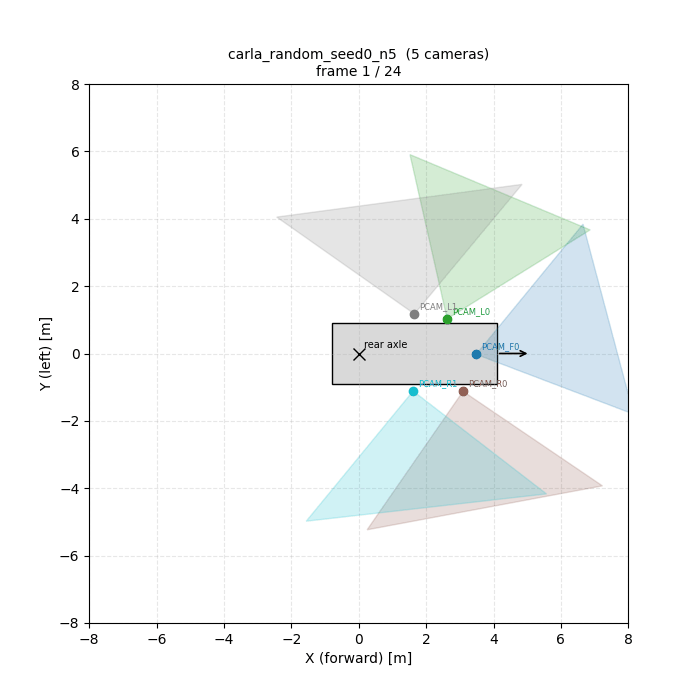

# Multi-rig CARLA data collection — runbook

> Note:
Most of this documentation was auto-generated via the usage of Coding LLM.

<p align="center">
  <a href="README.md">CLICK HERE TO GET TO README</a>
</p>

End-to-end guide for collecting py123d-format data with the multi-rig
pipeline (`lead/rig/`, `lead/expert/expert_multi_rig_py123d.py`,
`scripts/collect_carla_data.py`).

You need **two terminals**: one for the CARLA simulator, one for the
collection script. The simulator must be up and listening on its world port
*before* the collection script starts.

---

**Open Tasks:**

- [ ] Investigate lidar issue: I observed that some bounding box detections have lidar hits even though they are clearly not visible (behind trees or wall); likely the lidar is too high positioned
- [ ] Identify reason why some routes fail

---

## 0. One-time setup

Done once per machine.

```bash
# From master-thesis root
cd /home/bastian/dev/master-thesis/.external/lead

# Install CARLA 0.9.15 if not already present
bash scripts/setup_carla.sh

# Sanity-check the venv (uses uv, not pip)
source ../../.venv_training/bin/activate
uv pip list | grep -E "carla|py123d|opencv-python"
```

Expected: `carla`, `py123d`, `opencv-python==4.6.0.66`.

---

## 1. Generate rig JSONs

Rigs are JSON snapshots that drive the collection. You can generate any
number of random rigs and/or extract real-dataset rigs.

### 1a. Random rigs (CARLA-only, no datasets needed)

```bash
cd /home/bastian/dev/master-thesis/.external/lead
source ../../.venv_training/bin/activate
export PYTHONPATH=lead/expert:.:$PYTHONPATH

mkdir -p rigs
python -c "
from lead.rig.random_rig import generate_random_rig
from lead.rig import serialization

for seed in range(30):
    rig = generate_random_rig(num_cameras=6, seed=seed)
    serialization.save(rig, f'rigs/random_seed{seed}.json')
    print(f'Wrote rigs/random_seed{seed}.json ({len(rig.cameras)} cams)')
"
```

Some randomly generated rigs are visualized below (refer to [visualize_random_rigs.py](scripts/visualize_random_rigs.py)):
<p align="center">
  
</p>


### 1b. Real-dataset rigs (from py123d Arrow logs)

`scripts/export_dataset_rig.py` reads a **py123d Arrow log directory** and
emits a `RigConfig` JSON. Because every dataset that py123d can parse
(nuScenes, Waymo, nuPlan, AV2, KITTI360, PandaSet, Physical-AI-AV, ncore)
exposes the same scene API once it is in Arrow form, one script handles
all of them. CARLA is not required for this step. The raw dataset is also
not required — you only need the Arrow output of one scene.

The leaf log directory is the folder that holds the per-modality
``*.arrow`` files for one scene, e.g.
``<py123d_data_root>/logs/<split>/<log_name>/``.

```bash
# Pass an explicit log dir
python scripts/export_dataset_rig.py \
    --log-dir /path/to/py123d_data/logs/nuscenes_train/scene_0061 \
    --output rigs/nuscenes.json
```

```bash
# Or point at a PY123D_DATA_ROOT and let the script pick the first log
python scripts/export_dataset_rig.py \
    --data-root /path/to/py123d_data \
    --output rigs/nuscenes.json
```

`--rig-name` overrides the auto-derived rig name (default is
``carla_<dataset>_<location>``). Only pinhole cameras are exported —
fisheye and f-theta entries (rare) are skipped because `RigConfig` only
models pinhole intrinsics today.

---

## 2. Start CARLA (terminal 1)

```bash
cd /home/bastian/dev/master-thesis/.external/lead
bash scripts/start_carla.sh
```

CARLA must be up and idle on port 2000 before step 3. Leave this terminal
open. To stop CARLA later:

```bash
bash scripts/clean_carla.sh
```

You can verify it is running with `pgrep -a CarlaUE4`.

---

## 3. Run the collection (terminal 2)

```bash
cd /home/bastian/dev/master-thesis/.external/lead
source ../../.venv_training/bin/activate

# Required environment for the leaderboard stack
export LEAD_PROJECT_ROOT=$(pwd)
export CARLA_ROOT="${LEAD_PROJECT_ROOT}/3rd_party/CARLA_0915"
export PYTHONPATH=${CARLA_ROOT}/PythonAPI/carla:3rd_party/leaderboard_autopilot:3rd_party/scenario_runner_autopilot:lead/expert:.:$PYTHONPATH

# Wipe stale CARLA actors from a prior aborted run
python3 scripts/reset_carla_world.py

# Bulk: every rig in rigs/dataset_demo, sample 6 routes from leaderboard1
python -u scripts/collect_carla_data.py \
    --rigs-dir rigs/dataset_demo \
    --routes-dir data/data_routes/leaderboard1 \
    --max-routes 6 \
    --routes-seed 42 \
    --per-route-timeout 90 \
    --output-base data/carla_multi_rig_py123d
```

Or with an explicit list (still supported):

```bash
python -u scripts/collect_carla_data.py \
    --rig rigs/random_seed0.json --rig rigs/nuscenes.json \
    --routes data/data_routes/leaderboard1/BlockedIntersection/Town06_13.xml \
    --routes data/data_routes/leaderboard1/T_Junction/Town04_2.xml \
    --output-base data/carla_multi_rig_py123d
```

Useful flags:

| Flag | Default | Notes |
|---|---|---|
| `--rig <path>` | — | Repeatable; explicit per-rig file. Combine freely with `--rigs-dir`. |
| `--rigs-dir <dir>` | — | Loads every `*.json` under the directory. |
| `--routes <xml>` | — | Repeatable; explicit per-route file. Combine freely with `--routes-dir`. |
| `--routes-dir <dir>` | `data/data_routes/leaderboard1` (when neither `--routes` nor `--routes-dir` is set) | Recursively collects every `*.xml` under the directory. |
| `--max-routes <n>` | unlimited | Cap on the number of routes after shuffling. |
| `--routes-seed <int>` | `0` | RNG seed for the route shuffle (deterministic). |
| `--no-shuffle-routes` | off | Iterate routes in alphabetical order instead. |
| `--per-route-timeout <s>` | `120` | Wall-clock budget per route. Send `SIGINT` to flush + advance once exceeded. |
| `--timeout <s>` | `600` | Leaderboard agent watchdog (per-tick). |
| `--output-base <dir>` | `data/carla_multi_rig_py123d` | One subdir per rig under this; routes accumulate inside. |
| `--carla-port <n>` | `2000` | World port your CARLA is listening on. |
| `--no-wiggle` | off | Disable per-frame extrinsic jitter. |
| `--lead-log-level` | `INFO` | `DEBUG` is very verbose. |

Routes are run **sequentially**; rigs run in **parallel** within each route's
single CARLA simulation. Each rig accumulates one log per route under
`<output-base>/<rig_name>/logs/carla_train/`.

The script sets `LEAD_MULTI_RIG_CONFIGS` and `LEAD_MULTI_RIG_OUTPUT_BASE`
internally and calls
`leaderboard_evaluator_local.py --agent=lead/expert/expert_multi_rig_py123d.py`
once per route. It also sets `LEAD_EXPERT_CONFIG` to widen the lidar-save
crop to `±60 m` on both axes (LEAD's default is `[-32, 64] × [-40, 40]`,
which strands a lot of side / rear vehicles outside the crop and zeroes
their `num_lidar_points`). To revert, drop the `min_x_meter`/`max_x_meter`/
`min_y_meter`/`max_y_meter` overrides from the script.

To stop the whole loop early (Ctrl-C the script). To stop a single in-flight
route while the loop continues:

```bash
PID=$(pgrep -f leaderboard_evaluator_local.py | head -1)
kill -INT "$PID"
```

`SIGINT` triggers the leaderboard's signal handler, which calls
`agent.destroy()`, which closes every per-rig writer.

---

## 4. Verify the output

```
data/carla_multi_rig_py123d/
├── _lead_default/                  # LEAD's default writer (unused, can ignore)
├── carla_random_seed0/
│   ├── rig.json                    # if you copy your input rig in here
│   └── logs/carla_train/<route>/
│       ├── camera.pcam_f0.arrow
│       ├── camera.pcam_l0.arrow
│       ├── ...
│       ├── box_detections_se3.arrow
│       ├── ego_state_se3.arrow
│       ├── traffic_light_detections.arrow
│       └── sync.arrow
├── carla_random_seed1/...
└── carla_nuscenes/...
```

Quick read-back:

```bash
cd /home/bastian/dev/master-thesis
source .venv_training/bin/activate
python <<'EOF'
from pathlib import Path
from py123d.api.scene.arrow.arrow_scene_api import ArrowSceneAPI
from py123d.datatypes import ModalityType

LOG = next(
    (Path(".external/lead/data/carla_multi_rig_py123d/carla_random_seed0/logs/carla_train")).iterdir()
)
api = ArrowSceneAPI(log_dir=LOG)
print("iterations:", api.number_of_iterations)
for k, m in api.get_all_modality_metadatas().items():
    print(" ", k)

cam = api.get_modality_at_iteration(0, ModalityType.CAMERA, "pcam_f0")
print("front cam:", cam.metadata.width, "x", cam.metadata.height,
      "fx=", cam.metadata.intrinsics.fx)

boxes = api.get_modality_at_iteration(5, ModalityType.BOX_DETECTIONS_SE3)
n_with_pts = sum(1 for b in boxes.box_detections if b.attributes.num_lidar_points is not None)
print(f"iter 5: {len(boxes.box_detections)} boxes, {n_with_pts} have num_lidar_points")
EOF
```

---

## 5. Visualize random rigs as a BEV GIF

Inspect random rig samples without running CARLA:

```bash
cd /home/bastian/dev/master-thesis/.external/lead
source ../../.venv_training/bin/activate
export PYTHONPATH=lead/expert:.:$PYTHONPATH

python scripts/visualize_random_rigs.py \
    --num-rigs 24 \
    --num-cameras 6 \
    --output rigs/random_rigs_bev.gif
```

The GIF cycles through randomly seeded rigs, drawing the ego rectangle and
each camera's mount + horizontal FOV wedge in BEV (X forward = up,
Y left = left). Pass `--num-cameras 4` (or any value 4–8) and any
`--num-rigs` you like.

---

## 6. Common gotchas

- **`KeyError: 'lidar2'`**: `use_two_lidars=true` is the LEAD default. The
  collection script forces `use_two_lidars=false`. If you see this, you are
  running an older script — re-pull or run `collect_carla_data.py` only.
- **`A sensor took too long to send their data`**: usually a downstream
  symptom of an earlier `KeyError`/`AttributeError`. Look for the *first*
  traceback in the log.
- **Empty rig output dir, no Arrow files**: agent failed during `setup()`.
  Search the log for `Could not set up the required agent` and read the
  Python traceback above it.
- **`Actor(id=...) not found!` spam**: harmless `CarlaDataProvider` warnings
  while the leaderboard rebuilds its actor cache after a fresh world reset.
  They stop once the ego is fully spawned.
- **Slow ticks**: each rig camera is rendered every CARLA tick. With 6+ rigs
  of 6 cameras at 800×450 you will see ~1 s/tick. Reduce rig count or
  resolution if that bites.
- **`Skipping save at step ...: ego unstable (vz=...)`** in the log: the
  agent has detected free-fall or a tumble (CARLA spawned the ego with a
  Z that doesn't match the road and physics dropped it) and is refusing
  to write the frame. Most Town12 routes spawn cleanly; a few have
  garbage Z values. The check rejects |vz| > 1 m/s and roll/pitch > 20°.
  The route is allowed to keep ticking — sometimes the ego catches the
  ground and we resume saving cleanly mid-route.

---

## 7. Where the code lives

| Path | Purpose |
|---|---|
| `lead/rig/coord_transform.py` | CARLA ↔ py123d (cameras + lidars), used by both directions |
| `lead/rig/rig_config.py` | `RigConfig`, `CameraEntry`, `LidarEntry`, `WiggleConfig` dataclasses |
| `lead/rig/serialization.py` | Round-trip JSON I/O |
| `lead/rig/random_rig.py` | `generate_random_rig`, `is_valid` |
| `lead/rig/dataset_rig.py` | `extract_nuscenes`, generic adapter for other parsers |
| `lead/rig/wiggle.py` | Per-frame extrinsic jitter |
| `lead/rig/frustum_filter.py` | Drop boxes invisible to all rig cameras |
| `lead/expert/expert_multi_rig_py123d.py` | The CARLA agent for multi-rig collection |
| `lead/expert/expert_py123d.py` | (Patched) `num_lidar_points` plumbed into `BoxDetectionAttributes` |
| `scripts/export_dataset_rig.py` | Standalone dataset → `rig.json` |
| `scripts/collect_carla_data.py` | Top-level entry point (terminal 2) |
| `scripts/visualize_random_rigs.py` | BEV GIF for random rigs |
| `tests/rig/` | Round-trip + validity + frustum tests (`pytest tests/rig`) |
